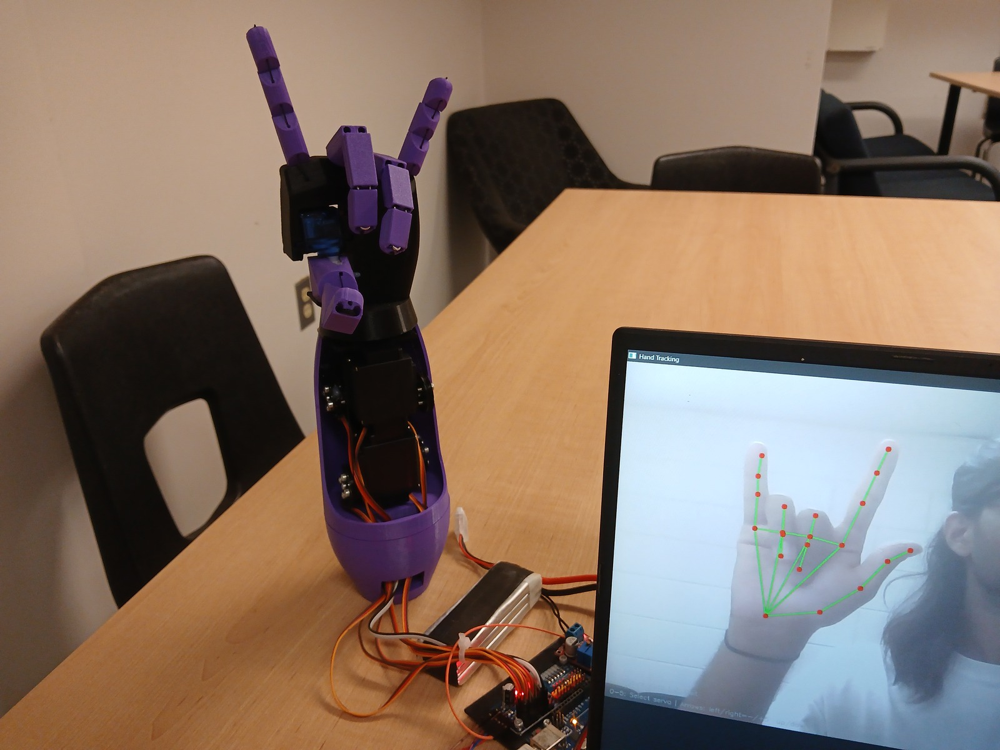
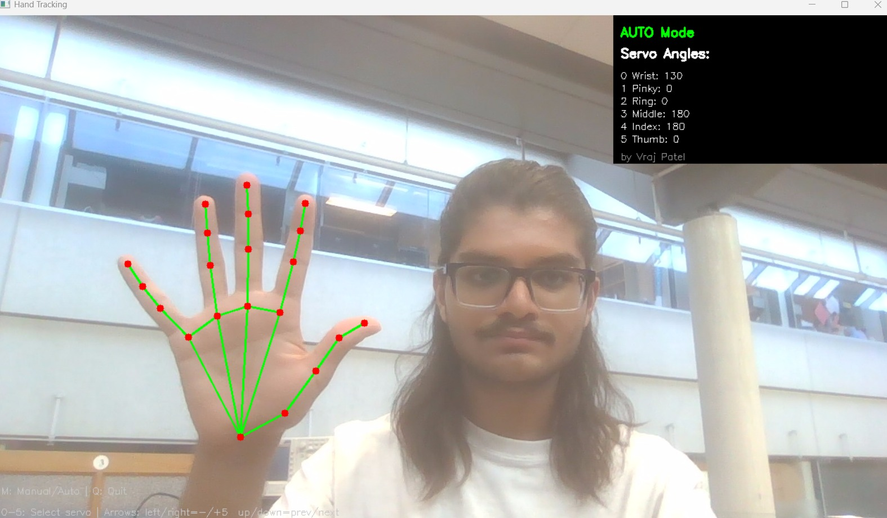
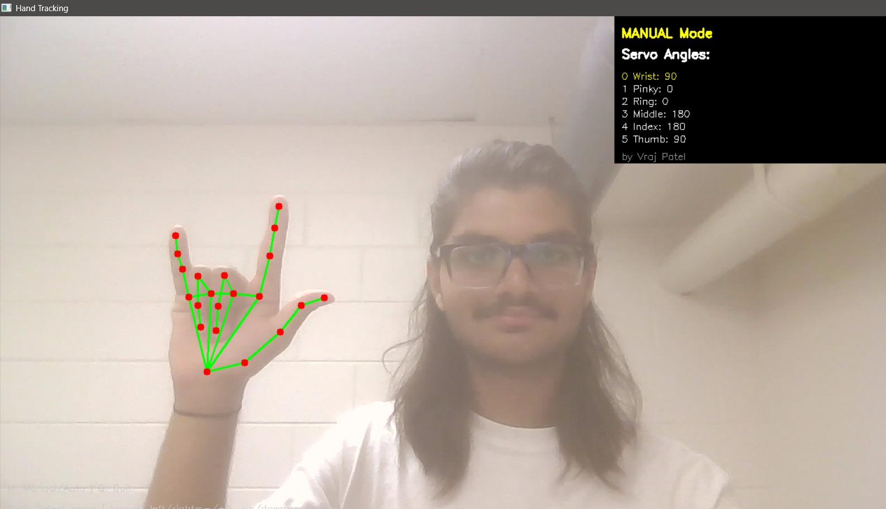

# Gesture-Controlled Robotic Hand

I built this hand to copy webcam hand movements without a glove. OpenCV and MediaPipe supply hand landmarks, which Python maps to calibrated angles for five finger servos and one wrist servo. Python smooths the commands and sends them over serial to an Arduino and PCA9685.



## Run

Use Windows for the arrow-key controls. From the repository root, install the Python dependencies:

```sh
python -m pip install -r requirements.txt
```

Download the [MediaPipe Hand Landmarker model](https://ai.google.dev/edge/mediapipe/solutions/vision/hand_landmarker/index#models) and save it as `hand_landmarker.task` in the repository root.

Install the Adafruit PWM Servo Driver library in Arduino IDE and upload `firmware/hand_control/hand_control.ino`. Set the serial port in `src/main.py` and `src/servo_test.py` for your Arduino; both use `COM5` at 9600 baud. Camera index is `0`.

PCA9685 channels 0-5 are wrist, pinky, ring, middle, index and thumb. Check the calibrated open/closed angles and firmware pulse limits against your linkage travel and power wiring before moving the servos.

```sh
python src/main.py
```

`M` toggles automatic/manual mode. In manual mode, select a servo with `0`-`5` or up/down arrows, then adjust it with left/right arrows. `Q` exits.

## Source

- `src/main.py`: webcam tracking, angle mapping, smoothing and manual controls.
- `src/servo_test.py`: alternates open/closed poses over serial, then returns to open.
- `firmware/hand_control/hand_control.ino`: receives six angles and maps them to channel pulse limits.
- `tools/i2c_scan/i2c_scan.ino`: scans I2C addresses and reports them at 9600 baud.

## Webcam views




